<!--
  ┌─────────────────────────────────────────────────────────────────────┐
  │  John Paul Tayong — GitHub profile README                           │
  │  Theme: "Elevated Terminal / Dev OS" — amber #C2925A on charcoal.    │
  │  Every visual is a self-contained animated SVG (no flat code blocks, │
  │  no follower/commit/streak widgets). Light- AND dark-mode safe.      │
  │  Local assets: wordmark · portrait · whoami · capabilities ·         │
  │                activity (signature) · experience · divider           │
  └─────────────────────────────────────────────────────────────────────┘
-->

<!-- ░░░░░░░░░░░░░░░░░░░░  HERO  ░░░░░░░░░░░░░░░░░░░░ -->

 

 

<!-- ░░░░░░░░░░░░░░░░░░░░  INTRO — portrait + whoami card  ░░░░░░░░░░░░░░░░░░░░ -->

  

> I build at the **application layer** — taking frontier models like **OpenAI** and **Gemini** and
> engineering them into systems that hold up in production: **voice agents, RAG pipelines, LLM
> integrations, and automation**, plus the **full-stack** around them — web apps, APIs, dashboards.
> I focus on the part most demos skip: making it reliable, maintainable, and genuinely useful.

<!-- ░░░░░░░░░░░░░░░░░░░░  WHAT I BUILD  ░░░░░░░░░░░░░░░░░░░░ -->

<!-- ░░░░░░░░░░░░░░░░░░░░  STACK  ░░░░░░░░░░░░░░░░░░░░ -->

#### `$ ls ~/stack`

<!-- ░░░░░░░░░░░░░░░░░░░░  SIGNATURE — activity board  ░░░░░░░░░░░░░░░░░░░░ -->

<code>// a decorative signal — not a contribution graph. always building.</code>

<!-- ░░░░░░░░░░░░░░░░░░░░  EXPERIENCE  ░░░░░░░░░░░░░░░░░░░░ -->

<!-- ░░░░░░░░░░░░░░░░░░░░  CONTACT  ░░░░░░░░░░░░░░░░░░░░ -->

#### `$ ./contact.sh`

**Have an AI idea or a product to ship?**
I'm open to AI engineering and full-stack roles, freelance work, and collaborations — and I reply to every message.

