<!--
  ┌─────────────────────────────────────────────────────────────────────┐
  │  John Paul Tayong — GitHub profile README                           │
  │  Theme: "Elevated Terminal / Dev OS" — amber #C2925A on charcoal.    │
  │  Balanced: AI Engineer + Full-Stack Developer (AI systems & apps).   │
  │  No follower/commit/streak widgets. Adapts to light AND dark mode.   │
  │  Local animated SVGs: wordmark.svg · capabilities.svg · divider.svg  │
  └─────────────────────────────────────────────────────────────────────┘
-->

<!-- ░░░░░░░░░░░░░░░░░░░░  HERO WORDMARK  ░░░░░░░░░░░░░░░░░░░░ -->
<div align="center">



<br/>

<!-- role + rotating taglines (animated typewriter) -->


<br/>


<br/><br/>

<a href="https://ioannes.dev">
  
</a>
<a href="https://www.linkedin.com/in/tayong-john-paul-t-b65206347/">
  
</a>
<a href="mailto:john@ioannes.dev">
  
</a>

</div>


<!-- ░░░░░░░░░░░░░░░░░░░░  $ whoami  ░░░░░░░░░░░░░░░░░░░░ -->
### `$ whoami`

```ansi
johnpaul@ioannes.dev
──────────────────────────────────────────────
 role........ AI Solutions Engineer @ OneTouch Networks (Remote · SF)
 base........ Cebu, Philippines
 education... BS Computer Engineering — CTU, Danao Campus
 builds...... AI-powered systems  +  full-stack web apps & APIs
 ai.......... Voice agents · RAG · LLM integration · automation
 systems..... Web apps · dashboards · APIs · end-to-end products
 backend..... Python · FastAPI · Django · Node.js
 frontend.... React · Next.js · TypeScript · Tailwind
 status...... ● open to AI engineering & full-stack opportunities
```

> I'm an **AI Engineer and Full-Stack Developer** who turns AI into working products. I build
> at the application layer — taking frontier models like **OpenAI and Gemini** and engineering
> them into real systems: **voice agents, RAG pipelines, LLM integrations, and automation** —
> along with the **full-stack** that surrounds them: web apps, APIs, and dashboards. My focus
> is the part most demos skip — making it reliable, maintainable, and genuinely useful in
> production.


<!-- ░░░░░░░░░░░░░░░░░░░░  $ cat ~/what-i-build.md  ░░░░░░░░░░░░░░░░░░░░ -->
### `$ cat ~/what-i-build.md`

<div align="center">


</div>


<!-- ░░░░░░░░░░░░░░░░░░░░  $ ls ~/stack  ░░░░░░░░░░░░░░░░░░░░ -->
### `$ ls ~/stack`

**Languages**


**Frontend**


**Backend & APIs**


**AI / ML**


**Data & Infra**


<!-- ░░░░░░░░░░░░░░░░░░░░  $ git log --oneline ~/experience  ░░░░░░░░░░░░░░░░░░░░ -->
### `$ git log --oneline ~/experience`

```bash
* 7a1f9c2  (HEAD -> main)  AI Solutions Engineer · OneTouch Networks — Remote (SF)
|              Jul 2025 – Present
|              ▸ Design & ship AI agents that automate workflows for real clients
|              ▸ Deploy + maintain production AI systems for reliability at scale
|              ▸ Prototype & integrate emerging AI tooling into client solutions
|
* d4e2b08  Freelance AI Engineer & Full Stack Developer · Independent — Remote
               2024 – 2025
               ▸ Built AI tools, automation & full-stack web apps for intl. clients
               ▸ Shipped Django + React products end to end (OpenAI / Gemini)
```


<!-- ░░░░░░░░░░░░░░░░░░░░  $ ./contact.sh  ░░░░░░░░░░░░░░░░░░░░ -->
### `$ ./contact.sh`

<div align="center">

> **Have an AI idea or a product to ship?** I'm open to AI engineering and full-stack roles, freelance work, and collaborations — and I reply to every message.

<a href="mailto:john@ioannes.dev">
  
</a>
<a href="https://ioannes.dev">
  
</a>
<a href="https://www.linkedin.com/in/tayong-john-paul-t-b65206347/">
  
</a>

</div>

<!-- ░░░░░░░░░░░░░░░░░░░░  FOOTER WAVE  ░░░░░░░░░░░░░░░░░░░░ -->

