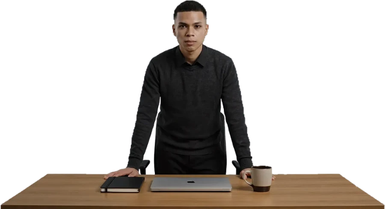

<!--
  ┌─────────────────────────────────────────────────────────────────────┐
  │  John Paul Tayong — GitHub profile README                           │
  │  Theme: "Elevated Terminal / Dev OS" — amber #C2925A on charcoal.    │
  │  Every panel is a self-contained animated SVG terminal window.       │
  │  No flat code blocks. No follower/commit/streak widgets.             │
  │  Local assets: wordmark · portrait · whoami · capabilities ·         │
  │                agent (signature) · experience · divider              │
  └─────────────────────────────────────────────────────────────────────┘
-->

<!-- ░░░░░░░░░░░░░░░░░░░░  HERO  ░░░░░░░░░░░░░░░░░░░░ -->

 

 

<!-- ░░░░░░░░░░░░░░░░░░░░  INTRO — portrait + whoami  ░░░░░░░░░░░░░░░░░░░░ -->

  

> I build **systems** at the application layer — taking frontier models like **OpenAI** and
> **Gemini** and engineering them into production: **AI agents, RAG pipelines, LLM integrations,
> and automation**, plus the **full-stack** around them — APIs, dashboards, and end-to-end
> products. I focus on the part most demos skip: making it reliable, maintainable, and genuinely useful.

<!-- ░░░░░░░░░░░░░░░░░░░░  WHAT I BUILD  ░░░░░░░░░░░░░░░░░░░░ -->

<!-- ░░░░░░░░░░░░░░░░░░░░  STACK  ░░░░░░░░░░░░░░░░░░░░ -->

#### `$ ls ~/stack`

&nbsp;

&nbsp;

&nbsp;

<!-- ░░░░░░░░░░░░░░░░░░░░  SIGNATURE — coding agent  ░░░░░░░░░░░░░░░░░░░░ -->

<!-- ░░░░░░░░░░░░░░░░░░░░  EXPERIENCE  ░░░░░░░░░░░░░░░░░░░░ -->

<!-- ░░░░░░░░░░░░░░░░░░░░  CONTACT  ░░░░░░░░░░░░░░░░░░░░ -->

#### `$ ./contact.sh`

**Have an AI idea or a product to ship?** &nbsp;Open to AI engineering & full-stack roles, freelance, and collabs — I reply to every message.

